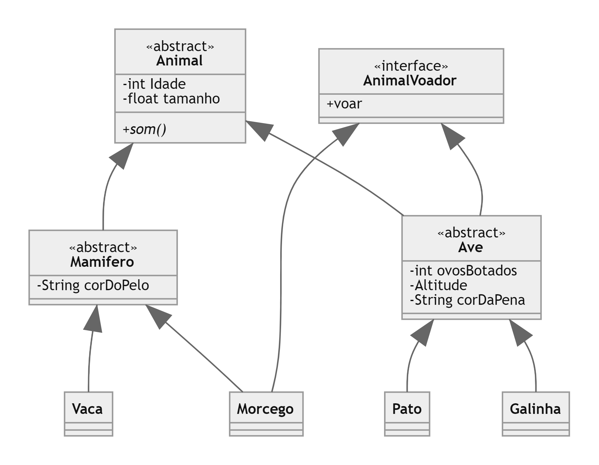

# Lett estagio

Esses programas foram feitos para o teste de nivelamento para o estágio na Lett.
O primeiro programa e sobre **POO** e o segundo é sobre **web scraper**

# POO

O programa consiste em fazer um cadastro de 4 animais distintos, que são separados em 2 tipos Mamiferos e aves.

#### Diagrama UML 

Diagrama UML para representar a implementação das classes

# Web Scraper 
O programa tem como objetivo de entrar no site de um e-comerce e extrair informaçoes sobre o produto.

O site escolhido para fazer o scraping foi o e-comerce [**Kabum**](https://kabum.com.br/)
o programa recebe um ou mais links de produtos (separados por ";") e coleta as informações:
 - Nome do produto completo
 - Preço antes da promoção (caso o produto esteja em promoção)
 - preço atual 
 - preço de cada parcela
 - preço com desconto avista e o valor do desconto
 - Links das imagens do produto
